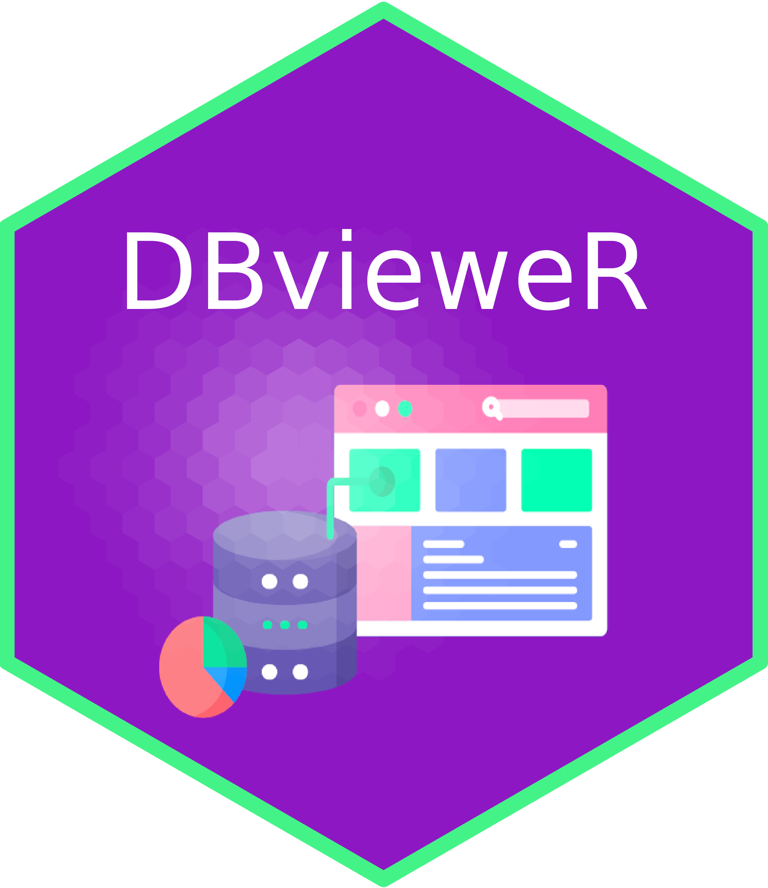

<!-- README.md is generated from README.Rmd. Please edit that file -->

# DBvieweR  <a href="https://munoztd0.shinyapps.io/DbVieweR"></a>


<!-- badges: start -->

<!-- [](https://cran.r-project.org/package=dplyr)
[](https://github.com/tidyverse/dplyr/actions/workflows/R-CMD-check.yaml)
[](https://app.codecov.io/gh/tidyverse/dplyr?branch=main) -->
[](https://github.com/munoztd0/DbVieweR/actions/workflows/R-CMD-check.yaml)
[](https://lifecycle.r-lib.org/articles/stages.html#stable)

<!-- badges: end -->
<br>
<br>
<br>
<br>

## A modern Database Management System for R 

# Overview

About this Shiny app:

This Shiny app simulates a database management system featuring functions like login/logout, save/create/delete tables, add/rename columns, etc.

Features of this app:

1. Back-end database: A SQLite database that stores dummy data. 
2. Authorization: Credit to the package [`shinyauthr`](https://github.com/paulc91/shinyauthr) which provides module functions that can be used to add an authentication layer to shiny apps.  
3. Highlights of the functions:
    - Save tables: save a store sales summary table to the database.
    - Update existing tables: rename tables, rename/add columns of tables.
    - Create new tables: table and column names can be customized. Provide 4 types of column to be added - integer, float, varchar(255), and boolean. 
    - Create entries to tables:  prompt columns contained in the selected table together with their types. 
    - Delete tables: the action is only accessible to specific authorization.
4. Robustness: Defense mechanism that prevents duplicates, invalid expressions, and conflicts with SQL keywords are set for all the input table and colunm names to ensure the smooth execution of SQL queries. Once errors are detected, prompt messages will show up suggesting possible failure reasons. 


[Check the Live Demo For Yourself](https://munoztd0.shinyapps.io/DbVieweR)
[Check the YouTube Demo](https://www.youtube.com/watch?v=0-FzIsBQEgA)


## Core Functionalities:

1. **Data Viewing and Exploration**
   - View database tables
   - Explore data with interactive tools
   - Filter and search within tables
   - Download filtered views of data

2. **Table and Data Modification**
   - Modify table names
   - Edit, add, and delete columns
   - Add new columns with custom expressions
   - Add and delete rows
   - Delete entire tables

3. **Data Import**
   - Import tables from CSV files
   - Import tables from XLS/XLSX files

4. **Data Visualization**
   - Generate interactive visualizations of your data
   - Download generated graphs

## About the App

This app provides a comprehensive suite of tools for database management, data exploration, and visualization. Whether you're a data analyst, database administrator, or business user, our app offers intuitive interfaces for handling various aspects of data management and analysis.

From basic operations like viewing and filtering data to more advanced features such as adding columns with expressions and generating visualizations, this app is designed to streamline your data workflow. The ability to import data from common formats like CSV and Excel makes it easy to bring your existing data into the system.

With its combination of data manipulation capabilities and visualization tools, this app serves as a one-stop solution for many of your data management and analysis needs.


# Explore your SQL databases with ease using our powerful and intuitive visualization tool! 📊✨

## ✨ Key Features

### 📁 Dynamic Table Selection
- **Smart Table Listing**: Automatically detects and displays all tables in your connected database.
- **User-Friendly Interface**: Easy-to-use dropdown menu for quick table selection.

### 🔍 Interactive Data Exploration
- **Powered by GWalkR**: Utilizes the GWalkR package for creating interactive and insightful data visualizations.
- **Real-Time Rendering**: Visualizations are generated on-the-fly as you explore different tables.

### 🖼️ Customizable Visualizations
- **One-Click Generation**: Create stunning visualizations with just a single click of the "Generate Visualization" button.
- **Adaptive Display**: Visualizations adjust automatically to your data structure and content.

### ⚡ Responsive Design
- **Fluid Layout**: Optimized for various screen sizes and devices.
- **Intuitive Controls**: User-friendly interface for seamless navigation and interaction.

### 🔄 Real-Time Data Sync
- **Auto-Refresh**: Data is automatically fetched when switching between tables.
- **Always Up-to-Date**: Visualizations reflect the most current data in your database.

### 📈 Progress Tracking
- **Loading Indicators**: Clear progress messages keep you informed during data fetching and visualization generation.
- **Success Notifications**: Receive instant feedback when your visualization is ready to explore.

### 🛠️ Modular Architecture
- **Shiny Modules**: Built using Shiny modules for enhanced maintainability and scalability.
- **Easy Integration**: Seamlessly integrates with existing Shiny applications.

## 🔧 Technical Highlights

- **R Shiny**: Built on the robust and flexible Shiny framework for interactive web applications.
- **SQL Integration**: Direct connection to SQL databases for real-time data access.
- **Reactive Programming**: Utilizes Shiny's reactive programming model for efficient updates and smooth user experience.

## Installation

You can install the development version of DbVieweR from
[GitHub](https://github.com/) with:

``` r
# install.packages("devtools")
devtools::install_github("munoztd0/DbVieweR")
```


## Code of Conduct
  
Please note that the DbVieweR project is released with a [Contributor Code of Conduct](https://contributor-covenant.org/version/2/1/CODE_OF_CONDUCT.html). By contributing to this project, you agree to abide by its terms.


## TODO

- Add insert rows
- Add modify rows
- Add report
- Add automatic dataviz
